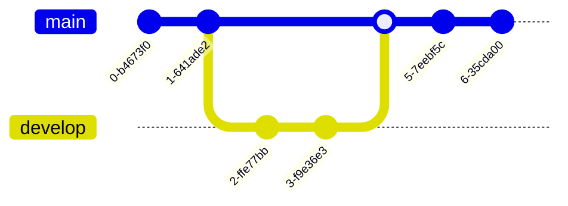

---
{"dg-publish":true,"permalink":"/inkorg/git/"}
---

# Git är ett versionshanteringsprogram

Ett versionshanteringssystem är program som håller koll på förändringar i koden (eller filer, och eller foldrar). De sparar också en del metadata för att hålla koll på vem som gjort en viss förändring och när förändringen gjordes.

## Kommandon
**git init** Skapar en ny git-repository. 
**git add** Lägger till de filer som ska tas med i nästa commit (nästa ögonblicksbild av koden)
**git commit** Skapar en ögonblicksbild (en commit) av alla de filer som lagts till med *git add* tidigare.
**git log --all --graph --decorate** Visar alla commits i en "fin" graf.
**git log --all --graph --decorate --oneline** Visar dem mer kompakt

För att lägga till alias så kör man 
**git config --global alias.graph "git log --all --graph --decorate --oneline"** För att till exempel lägga till *git graph* som kör git log --all --graph --decorate --oneline*.

**git push origin master:master** pushar lokala branchen master till origin(remote) branch master
För att slippa ange vilken lokal branch som hör ihop med vilken remote branch kan man skriva:
**git branch --set-upstream-to=origin/master**

Skillnaden mellan att använda **git fetch branchName** och **git pull** är att fetch hämtar branchen, men gör inte en merge. **git pull** == **git fetch; git merge**

**git add -p** Interaktiv staging (man kan till exempel välja att inte lägga till alla console.logs) sen när man gjort commit så kan man köra **git checkout branchNamn** för att få bort alla console.logs. 

**git stash** Sparar undan ändringar och återgår till senaste
**git stash pop** Tar tillbaka ändringar som stashats.

Kolla upp mer om *git bisect*

